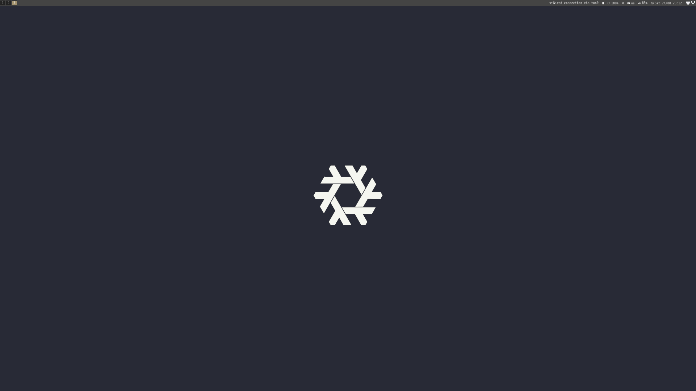
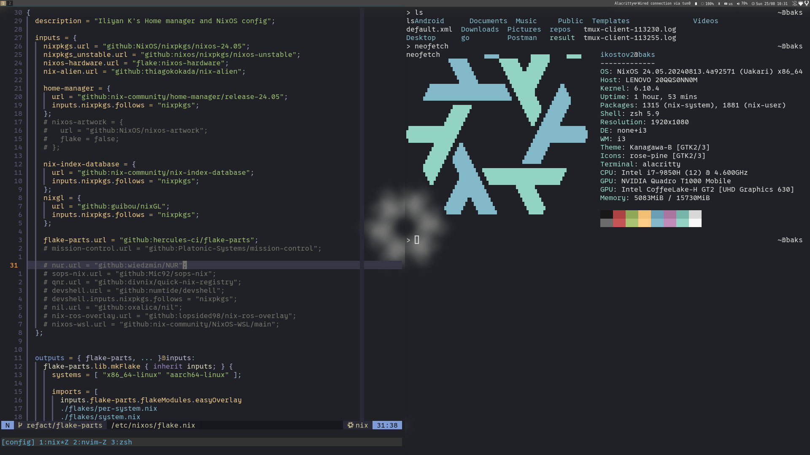

# ❄️ NixOS configuration ❄️

[](https://garnix.io/repo/IliyanKostov9/nixos-config)
[](https://www.gnu.org/licenses/gpl-3.0.en.html)
[](https://github.com/iliyan-kostov9/nixos-config/actions?query=branch%3Amaster)
[](https://github.com/iliyan-kostov9/nixos-config/actions/workflows/security-tests.yaml)
[](https://nixos.org/)
<!-- [](https://builtwithnix.org) -->
[](https://nixos.org)
[](#)
[](#)
[](#)
[](#-license)

:star: Star us on GitHub — it motivates us a lot!

## 🚀 About

> My personal NixOS configuration file.
> 

It contains hardware/software configurations for setting up my personal/work machines.

> [!IMPORTANT]
> As of this moment, I haven't yet reached the point of deploying VMs using Nix, meaning that this configuration **IS INTENDED TO BE USED FOR PERSONAL USE ONLY**.

Please don't try to copy-paste the configuration on your own machine and try to understand it first for the following reasons:
  1. It simply won't work, due to the difference in hardware configuration between my machines and yours (for example gpu drivers, device IDs)
  2. You won't learn much doing that, and later when you want to change something in your config it'll be harder for you to achieve that
  3. This config structure is made by my personal taste, not yours ... and if some certain functionalities are either missing or badly implemented - then you would need to fork my repo and make your desired change in your version. Nevertheless, I'm more than open to suggestions for improvements, so please feel free to open an issue!

## 🎉 Getting started

To get started, first run `make setup` for the script to label your nixos partition devices and enable secure boot.
Follow the prompts when asked in the process.

### 🧐 How-to: Create new user

1. Generate a hashed password for the user by executing `mkpasswd --method=sha-512 ` and put it in the `initialHashedPassword`)
2. Create a directory with name of your user at `home/{username}` and under that, create `default.nix` (you can copy `default.nix` content from iliyan and enable/disable the programs you need for your user)
3. Build your system and home manager (e.g `make build`)
4. You are all set!

## 🏝️ Environment

<p align="center">



</p>

<details>
<summary>Structure details</summary>

| Type           | Program      |
| :------------- | :----------: |
| Editor         | [NeoVim](https://neovim.io/) |
| Launcher       | [Rofi](https://github.com/davatorium/rofi) |
| Shell          | [Zsh](https://ohmyz.sh/) |
| Status Bar     | [i3status-rust](https://github.com/greshake/i3status-rust) |
| Terminal       | [Alacritty](https://alacritty.org/) |
| Window Manager | [I3WM](https://i3wm.org/) |
| File Manager   | [PcmanFM](https://en.wikipedia.org/wiki/PCMan_File_Manager) |
| GTK Theme      | [Adwaita](https://en.wikipedia.org/wiki/Adwaita_(design_language)) |
| GTK Icon Theme | [Rose-pine](https://github.com/rose-pine/gtk) |
| Terminal Font  | [OxProto Nerd Font](https://www.nerdfonts.com/font-downloads) |

</details>

## 🧪 Used Nix features 

1. home-manager
2. flakes
3. flake-parts
4. sops-nix

## 🏗️ Structure

```markdown
.
.
├── _config.yml
├── archive
├── assets
├── config.nix
├── flake.lock
├── flake.nix
├── flakes
├── garnix.yml
├── home
├── hosts
├── LICENSE
├── Makefile
├── programs
├── README.md
├── scripts
├── secrets
└── wallpaper.jpg
```

- **archive**: not used in building the system. It stores the initial configuration of NixOS when first installed. (you can ignore this part)
- **assets**: used for storing media files, related to markdown documentation 
- **config.nix**: An attribute set, containing all of the user and host specific configuration, that is consumed by the home and hosts module
- **flake.lock**: auto generated file, when building the system along with an argument of `--flake`. Used for pinning down the specific versions of the Nix dependencies, that are listed under *flake.nix*
- **flake.nix**: file for declaring all of the Nix specific dependencies/features (flake-parts, home-manager, nixpkgs, etc.). It is also the entry point for importing the user/system flakes
- **flakes**: used for storing all of the modularized flakes, that is consumed by flake-parts
- **home**: used for storing all the user environments (Joe's PC, Jane's PC, etc.)
- **hosts**: used for storing the hardware specifications of the hosts machines
- **Makefile**: automation script for aliasing Nix CLI commands in a more user-friendly way
- **programs**: contains the user/system type of packages
- **wallpaper.jpg**: background photo for i3wm

##  🧑‍💻 Commands

> [!WARNING]
> Before starting to execute `make` commands, make sure to change the value of `DEFAULT_USER` to your preffered username, located in `Makefile`.

|Command|Description|
|:-|:-|
|make help|Show available commands with their description|
|make home-update|Build your home configuration|
|make sys-update-|Build your system configuration|
|make flake-upgrade|Upgrade flake dependencies
|make flake-check|Validate flake.nix|
|make flake-meta|Output the flake input dependencies in a tree format|
|make clean|Remove system and user generations|
|make gen|Show all user generations|
|make setup|Setup your system|

### 🌱 Setup 

> [!CAUTION]
> The hardware specific configuration is most likely not going to properly work on your system, so please make sure after you install my configuration and immediately change the bootloader and file system values (located at `config.nix`) with your appropriate values!

<details><summary><b>Show instructions</b></summary>
   Install for work laptop (Thinkpad p53) or desktop PC (AMD).

  1. Work laptop

    nixos-rebuild switch --flake github:iliyan-kostov9/nixos-config#hosts-work-laptop

  2. Desktop PC

    nixos-rebuild switch --flake github:iliyan-kostov9/nixos-config#hosts-personal-desktop

  Afterwards enter `config.nix` and change the values of the file system and bootloader to the ones you currently have.
  You can also change the default username to your preferred one.

</details>

## 🤝 Acknowledgments

This configuration structure was inspired by contributions from the Nix community:

- [wimpysworld](https://github.com/wimpysworld/nix-config)
- [ryan4yin](https://github.com/ryan4yin/nix-config)
- [simple-homemanager](https://github.com/evertras/simple-homemanager)
- [chayward1] (https://github.com/chayward1/dotfiles)
- [notusknot] (https://github.com/notusknot/dotfiles-nix/tree/main)

### 🔍️ References 

This section helped me better understand Nix package manager and Nix language.
Please have a read on them!

#### 📚 Docs
- [ Nixpills ]( https://nixos.org/guides/nix-pills )
- [ Nix and flakes ]( https://nixos-and-flakes.thiscute.world )
- [ Home manager manual ]( https://nix-community.github.io/home-manager/index.xhtml )
- [ Intro to Nix and NixOS ]( https://nixos-and-flakes.thiscute.world/introduction )

#### 📄 Package and template links
- [ Nixpkgs ](https://search.nixos.org/packages) 
- [ MyNixOS ](https://mynixos.com/nixpkgs )
- [ NixOS cache ]( https://cache.nixos.org )
- [ Flake parts ]( https://community.flake.parts )

#### :art: Assets
- [NixOS artwork](https://github.com/NixOS/nixos-artwork)

### 📃 License
This product is licensed under [GNU General Public License](https://www.gnu.org/licenses/gpl-3.0.en.html)

